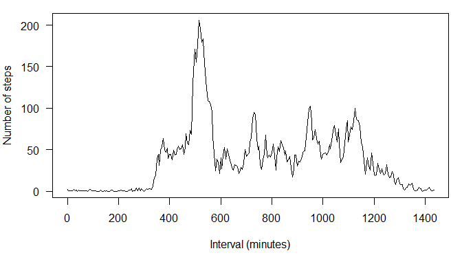

# Reproducible Research: Peer Assessment 1

First of all, load all required libraries and set the locale as English.

```r
library(plyr)
library(lattice)
```

```
## Warning: package 'lattice' was built under R version 3.1.3
```

```r
Sys.setlocale(category = "LC_ALL", locale = "English_United States.1252")
```

## Loading and preprocessing the data
First, unzip the provided zip file in the current directoy, and then read it.

```r
unzip("activity.zip", overwrite = TRUE)
rawData <- read.csv("activity.csv")
```

Second, preprocess raw data.
Steps column is as-is.
Convert string representation of date to Date class.
Convert integer representation of time of the day to minutes since midnight.
For example, integer value 1155 in raw data means 11:55 of the day.

```r
preprocessedData <- data.frame(steps = rawData$steps)
preprocessedData$date <- as.Date(rawData$date, "%Y-%m-%d")
preprocessedData$interval <- rawData$interval %/% 100 * 60 + rawData$interval %% 100
```

Display a few observations.

```r
head(preprocessedData)
```

```
##   steps       date interval
## 1    NA 2012-10-01        0
## 2    NA 2012-10-01        5
## 3    NA 2012-10-01       10
## 4    NA 2012-10-01       15
## 5    NA 2012-10-01       20
## 6    NA 2012-10-01       25
```

```r
tail(preprocessedData)
```

```
##       steps       date interval
## 17563    NA 2012-11-30     1410
## 17564    NA 2012-11-30     1415
## 17565    NA 2012-11-30     1420
## 17566    NA 2012-11-30     1425
## 17567    NA 2012-11-30     1430
## 17568    NA 2012-11-30     1435
```

Display the summary.

```r
summary(preprocessedData)
```

```
##      steps             date               interval     
##  Min.   :  0.00   Min.   :2012-10-01   Min.   :   0.0  
##  1st Qu.:  0.00   1st Qu.:2012-10-16   1st Qu.: 358.8  
##  Median :  0.00   Median :2012-10-31   Median : 717.5  
##  Mean   : 37.38   Mean   :2012-10-31   Mean   : 717.5  
##  3rd Qu.: 12.00   3rd Qu.:2012-11-15   3rd Qu.:1076.2  
##  Max.   :806.00   Max.   :2012-11-30   Max.   :1435.0  
##  NA's   :2304
```

## What is mean total number of steps taken per day?
Calculate the total number of steps taken each day.

```r
totalStepsPerDay <- tapply(preprocessedData$steps, preprocessedData$date, sum)
```

Draw histogram.

```r
par(mar=c(5,4,1,1), las=1)
hist(totalStepsPerDay, main="", xlab="Total steps per day")
```

 

Calucate the mean total number of steps taken per day.

```r
mean(totalStepsPerDay, na.rm = TRUE)
```

```
## [1] 10766.19
```

Calculate the median total number of steps taken per day.

```r
median(totalStepsPerDay, na.rm = TRUE)
```

```
## [1] 10765
```

## What is the average daily activity pattern?
Calculate the average steps of each 5-minute interval, and plot it.

```r
meanStepsPerInterval <- ddply(preprocessedData, .(interval), summarize, steps = mean(steps, na.rm=TRUE))
par(mar=c(5,4,1,1), las=1)
plot(meanStepsPerInterval$interval, meanStepsPerInterval$steps, type="l", xlab="Interval (minutes)", ylab="Number of steps")
```

 

Find the 5-minute interval which has the maximum number of steps taken in a day.

```r
maxInterval = meanStepsPerInterval$interval[which.max(meanStepsPerInterval$steps)]
maxHour = maxInterval %/% 60
maxMinute = maxInterval %% 60
print(sprintf("Maximum interval is at %d minutes, or %02d:%02d", maxInterval, maxHour, maxMinute))
```

```
## [1] "Maximum interval is at 515 minutes, or 08:35"
```

## Imputing missing values
The toal number of missing values in the dataset.

```r
sum(is.na(preprocessedData$steps))
```

```
## [1] 2304
```

Use mean value of 5-minute interval as missing value for the days with NA.
Creating the new data set by filling missing values.

```r
interpolatedData <- preprocessedData
for (i in 1:nrow(interpolatedData)){
    if (is.na(interpolatedData[i,]$steps)){
        interpolatedData[i,]$steps <-
            meanStepsPerInterval[which(meanStepsPerInterval$interval == interpolatedData[i,]$interval),]$steps
    }
}
totalStepsPerDayInterpolated <- tapply(interpolatedData$steps, interpolatedData$date, sum)
```

Draw histogram. Compare interpolated data and original data.

```r
par(mfrow=c(1,2))
hist(totalStepsPerDayInterpolated, main="Histogram after Interpolation", xlab="Total steps per day", ylim=c(0,35))
hist(totalStepsPerDay, main="Histogram before Interpolation", xlab="Total steps per day", ylim=c(0,35))
```

 

Calucate the mean total number of steps taken per day.

```r
mean(totalStepsPerDayInterpolated)
```

```
## [1] 10766.19
```

Calculate the median total number of steps taken per day.

```r
median(totalStepsPerDayInterpolated)
```

```
## [1] 10766.19
```

Mean value is not changed before and after interpolation.
Histogram after interpolation has additional 7 days only at the center distribution.
Table below proves that this data set has only days with all valid data and days with all missing data.
This naturally ends up that per day mean value is uncahnged by this interpolation.

```r
table(preprocessedData$date, is.na(preprocessedData$steps))
```

```
##             
##              FALSE TRUE
##   2012-10-01     0  288
##   2012-10-02   288    0
##   2012-10-03   288    0
##   2012-10-04   288    0
##   2012-10-05   288    0
##   2012-10-06   288    0
##   2012-10-07   288    0
##   2012-10-08     0  288
##   2012-10-09   288    0
##   2012-10-10   288    0
##   2012-10-11   288    0
##   2012-10-12   288    0
##   2012-10-13   288    0
##   2012-10-14   288    0
##   2012-10-15   288    0
##   2012-10-16   288    0
##   2012-10-17   288    0
##   2012-10-18   288    0
##   2012-10-19   288    0
##   2012-10-20   288    0
##   2012-10-21   288    0
##   2012-10-22   288    0
##   2012-10-23   288    0
##   2012-10-24   288    0
##   2012-10-25   288    0
##   2012-10-26   288    0
##   2012-10-27   288    0
##   2012-10-28   288    0
##   2012-10-29   288    0
##   2012-10-30   288    0
##   2012-10-31   288    0
##   2012-11-01     0  288
##   2012-11-02   288    0
##   2012-11-03   288    0
##   2012-11-04     0  288
##   2012-11-05   288    0
##   2012-11-06   288    0
##   2012-11-07   288    0
##   2012-11-08   288    0
##   2012-11-09     0  288
##   2012-11-10     0  288
##   2012-11-11   288    0
##   2012-11-12   288    0
##   2012-11-13   288    0
##   2012-11-14     0  288
##   2012-11-15   288    0
##   2012-11-16   288    0
##   2012-11-17   288    0
##   2012-11-18   288    0
##   2012-11-19   288    0
##   2012-11-20   288    0
##   2012-11-21   288    0
##   2012-11-22   288    0
##   2012-11-23   288    0
##   2012-11-24   288    0
##   2012-11-25   288    0
##   2012-11-26   288    0
##   2012-11-27   288    0
##   2012-11-28   288    0
##   2012-11-29   288    0
##   2012-11-30     0  288
```

Median value is changed, and it is now as same as mean value after the interpolation.
This is not inveitable result.
But, total steps of all interpolated days are as same as mean value,
one of these days is easily placed in the median position.

## Are there differences in activity patterns between weekdays and weekends?
Add new factor variable to indicate weekdays/weekends to the data frame.

```r
preprocessedData$category <- ifelse(weekdays(preprocessedData$date) %in% c("Saturday", "Sunday"), "weekend", "weekday")
meanStepsPerIntervalCategory <- ddply(preprocessedData, .(interval, category), summarize, steps = mean(steps, na.rm=TRUE))
```

Make a panel plot for weekdays and weekends.

```r
with(meanStepsPerIntervalCategory,
     xyplot(steps ~ interval | category, xlab="Interval (minutes)", ylab="Number of steps", type="l", layout=c(1,2)))
```

 

Weekdays have strong peak in the morning, while weekends have constant steps throughout the daytime.
Weekdays have distinctive activity early in the moring before 8:00am (480 minutes).
Weekends continue to have activity late night up to 9:00pm (1260 minutes).
